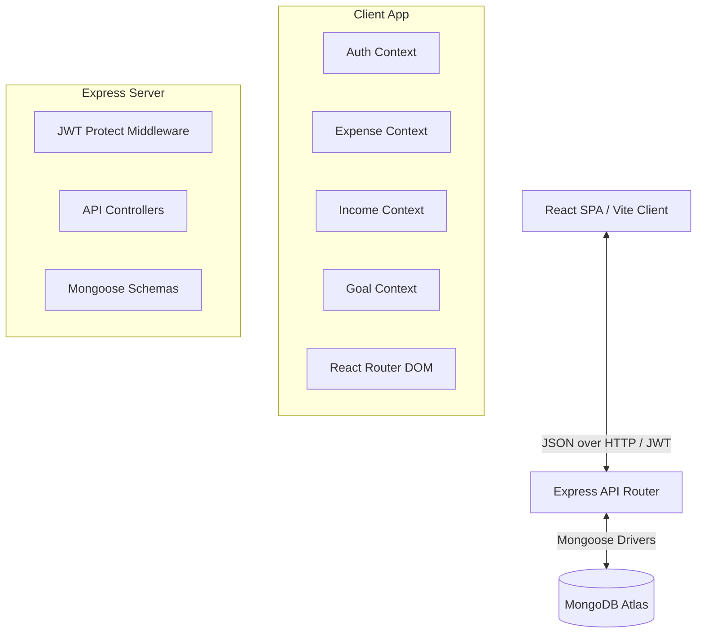
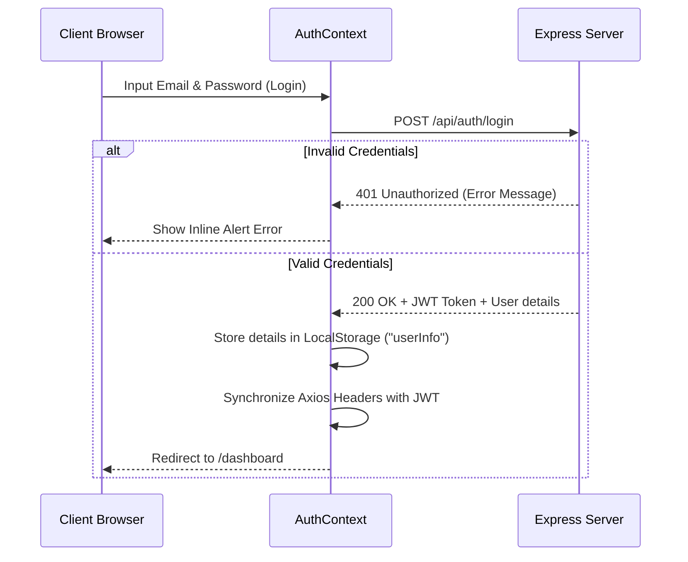

# TrackMyRupee - Detailed Project Flow & Architecture

Welcome to the comprehensive technical documentation for **TrackMyRupee**—a premium, responsive, and secure personal finance tracker. This document details the system architecture, frontend and backend data flows, database schemas, API endpoints, and all integrated features.

---

## 🏛️ System Architecture

TrackMyRupee is built using a decoupled Client-Server architecture:
1. **Frontend (Client)**: Single Page Application (SPA) built using **React**, **Vite**, **Recharts** (data visualization), **Framer Motion** (micro-interactions), and **Lucide React** (iconography).
2. **Backend (Server)**: RESTful API built using **Node.js**, **Express.js**, and Mongoose.
3. **Database**: **MongoDB Atlas** (cloud-hosted document store).



---

## 📂 Project Directory Structure

```text
TrackMyRupee/
├── backend/
│   ├── src/
│   │   ├── config/          # DB Connection & Environment Configs
│   │   ├── controllers/     # Route Business Logics (Auth, Expense, Income, Budget, Goal)
│   │   ├── middlewares/     # JWT Protection & Async Handler Wrappers
│   │   ├── models/          # MongoDB Mongoose Schema definitions
│   │   ├── routes/          # Express route bindings
│   │   └── server.js        # Main API entry point
│   ├── package.json
│   └── .env
└── frontend/
    ├── src/
    │   ├── assets/          # Global assets
    │   ├── components/      # Shared layout parts (Footer, Navs)
    │   ├── context/         # React Context API global state stores
    │   ├── pages/           # Page modules (Dashboard, Managers, Login, Landing)
    │   ├── utils/           # Helper scripts (Axios instance config)
    │   ├── App.jsx          # Route mappings & Layout bindings
    │   ├── index.css        # Core custom variables & glassmorphism styling
    │   └── main.jsx         # Client mount entry point
    ├── package.json
    └── vite.config.js
```

---

## 🔐 Authentication Flow

TrackMyRupee uses secure **JSON Web Token (JWT)** authentication.



- **Axios Interceptor**: Located in [axiosInstance.js](file:///c:/Users/adity/OneDrive/Desktop/TrackMyRupee/frontend/src/utils/axiosInstance.js), it automatically injects `Bearer <token>` inside the `Authorization` header of every HTTP call, and handles `401` error callbacks by clearing local storages and returning users to `/login`.

---

## 📊 Dashboard Modules & Flows

The dashboard is the central cockpit displaying financial health metrics. All metrics recalculate in real-time when expenses or incomes are added or modified.

### 1. Data Aggregation & Pacings
- **Available Balance**: Summarizes total income and subtracts total expenses:
  $$\text{Available Balance} = \sum(\text{Income}) - \sum(\text{Expenses})$$
- **Spending Pace**: Compares category thresholds against current total expenditure. Shows an `AlertTriangle` warning if spent funds reach **80%** or more of a set category budget.
- **Burn Rate**: Tracks average daily spend for the current month:
  $$\text{Daily Burn Rate} = \frac{\text{Total Month Expenses}}{\max(1, \text{Current Calendar Day})}$$

### 2. Quick Add Expense Form
- Placed prominently in the **top row** of the dashboard grid.
- Allows immediate, non-intrusive entries.
- Connecting to the `addExpense` dispatch inside [ExpenseContext.jsx](file:///c:/Users/adity/OneDrive/Desktop/TrackMyRupee/frontend/src/context/ExpenseContext.jsx) triggers local state updates, rendering refreshed charts and pace bars in milliseconds.

---

## 🛠️ Manager Panels & Feature Flows

### 1. Expense Manager (`/expenses`)
- **Export to CSV**: Generates a standard comma-separated spreadsheet (`expenses.csv`) directly in the client browser.
- **Search & Filters**: Supports keypress description searches and selective category filters.
- **Row Modifications**:
  - **Edit Actions**: Clicking the pencil icon opens a custom modal pre-filled with the current record's attributes. Submitting sends a `PUT /api/expenses/:id` call to the server and refreshes states seamlessly.
  - **Delete Actions**: Standardized deletion mapped to `DELETE /api/expenses/:id` that filters the item out instantly.

### 2. Income Manager (`/incomes`)
- **End-to-End PUT Route**:
  - Backend controller `updateIncome` in [incomeController.js](file:///c:/Users/adity/OneDrive/Desktop/TrackMyRupee/backend/src/controllers/incomeController.js) handles database transactions.
  - Mapped inside [incomeRoutes.js](file:///c:/Users/adity/OneDrive/Desktop/TrackMyRupee/backend/src/routes/incomeRoutes.js).
- **Edit & Modal Support**: Shares a symmetric workflow with the expense manager. Offers a dedicated source dropdown and visual indicators that update context balances cleanly upon submission.

### 3. Budget Manager (`/budgets`)
- Sets maximum spending boundaries per category.
- Displays progress gauges indicating spent percentage with dynamic color ranges (green: safe, yellow: warning at 80%, red: limit exceeded).

### 4. Goal Manager (`/goals`)
- Records savings target values and deadlines.
- Exposes an inline **Add Funds** PUT request supporting direct savings contribution increments, updating the visual target gauge in real-time.

---

## 🗄️ Database Schemas & Models

All database tables are defined using standard Mongoose Schemas in `backend/src/models`:

### 1. Expense Schema (`Expense.js`)
```javascript
{
  user: { type: ObjectId, ref: 'User', required: true },
  amount: { type: Number, required: true },
  category: { type: String, required: true, enum: ['Food', 'Transport', 'Shopping', 'Entertainment', 'Health', 'Bills', 'Other'] },
  date: { type: Date, default: Date.now },
  description: { type: String, required: true },
  isRecurring: { type: Boolean, default: false },
  recurringFrequency: { type: String, enum: ['none', 'daily', 'weekly', 'monthly'], default: 'none' },
  lastGeneratedDate: { type: Date }
}
```

### 2. Income Schema (`Income.js`)
```javascript
{
  user: { type: ObjectId, ref: 'User', required: true },
  amount: { type: Number, required: true },
  source: { type: String, required: true, enum: ['Salary', 'Freelance', 'Investments', 'Gifts', 'Refunds', 'Business', 'Other'] },
  date: { type: Date, default: Date.now },
  description: { type: String, required: true },
  isRecurring: { type: Boolean, default: false },
  recurringFrequency: { type: String, enum: ['none', 'daily', 'weekly', 'monthly'], default: 'none' },
  lastGeneratedDate: { type: Date }
}
```

### 3. Goal Schema (`Goal.js`)
```javascript
{
  user: { type: ObjectId, ref: 'User', required: true },
  title: { type: String, required: true },
  targetAmount: { type: Number, required: true },
  currentAmount: { type: Number, default: 0 },
  category: { type: String, required: true },
  deadline: { type: Date, required: true }
}
```

---

## 🔌 API Endpoint Catalog

All routes require validation via the `protect` JWT middleware.

| Method | Endpoint | Description | Payloads / Returns |
| :--- | :--- | :--- | :--- |
| **POST** | `/api/auth/register` | Sign up new user accounts | `{ name, email, password }` ➔ `{ token }` |
| **POST** | `/api/auth/login` | Log in existing users | `{ email, password }` ➔ `{ token, user }` |
| **GET** | `/api/expenses` | Retrieve user expense list | Query filters `?category=&month=&year=&search=` |
| **POST** | `/api/expenses` | Create new expenses | `{ amount, category, date, description, ... }` |
| **PUT** | `/api/expenses/:id` | Update expense values | `{ amount, category, description, date, ... }` |
| **DELETE**| `/api/expenses/:id` | Remove expenses | Returns `{ message: 'Expense removed' }` |
| **GET** | `/api/incomes` | Retrieve user income list | Query filters `?source=&month=&year=&search=` |
| **POST** | `/api/incomes` | Create new incomes | `{ amount, source, date, description, ... }` |
| **PUT** | `/api/incomes/:id` | Update income values | `{ amount, source, description, date, ... }` |
| **DELETE**| `/api/incomes/:id` | Remove incomes | Returns `{ message: 'Income removed' }` |
| **GET** | `/api/goals` | Retrieve user saving goals | Returns list of Goals |
| **POST** | `/api/goals` | Create new savings goals | `{ title, targetAmount, category, deadline }` |
| **PUT** | `/api/goals/:id/add-funds` | Add savings increments | `{ amount: Number }` |
| **DELETE**| `/api/goals/:id` | Remove savings goals | Returns standard success status |

---

## 🎨 Premium Visual Standards

TrackMyRupee aligns with premium light/dark styling guidelines:
- **Calm, Glare-Free Light Mode**: primary backgrounds use a relaxing sage-slate cream palette (`#edf2f0`) that cuts down eye strain, matching sage gray outlines (`#d1dbd6`), and custom slate text.
- **Translucent Glassmorphism**: Cards and navigation headers use a high-end transparent background overlay (`rgba(255,255,255,0.55)` / `rgba(31,41,55,0.7)`) bound with deep hardware-accelerated backplane filters (`backdrop-filter: blur(12px)`).
- **Tactile Hover Dynamics**: Responsive layout cards lift gracefully (`transform: translateY(-3px)`) and glow with soft shadows under visual interactions.
