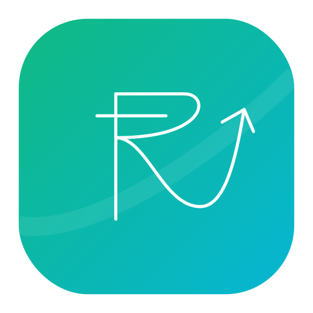

<div align="center">
  
  <h1>📈 TrackMyRupee</h1>
  <p><strong>A beautifully designed, full-stack personal finance and expense tracking application.</strong></p>

  [](https://track-my-rupee.vercel.app/)
  [](https://track-my-rupee.vercel.app/)
</div>

<br />

Welcome to **TrackMyRupee**, a comprehensive expense tracker built with the MERN stack (MongoDB, Express, React, Node.js). Designed with a focus on usability, clean aesthetics, and responsive performance, this app gives you everything you need to manage your personal finances effectively.

🚀 **Live Link:** [https://track-my-rupee.vercel.app/](https://track-my-rupee.vercel.app/)

---

## ✨ Features

* 📊 **Interactive Dashboard:** Get a clear overview of your financial health with beautiful area charts and pie charts using Recharts.
* 💰 **Expense & Income Management:** Easily record, edit, and organize all your transactions. Search and filter by category or date instantly.
* 🎯 **Smart Budgeting:** Set customized budgets for different categories. Visual progress bars track your spending and alert you when you cross 80%.
* 🔄 **Recurring Expenses:** Automate your fixed costs! Mark expenses as daily, weekly, or monthly, and a robust backend cron job handles the rest.
* 👥 **Group Expenses:** Split bills and manage shared expenses seamlessly with friends and family.
* 🔐 **Secure Authentication:** Enjoy secure access with unified login options, including JWT-based local authentication and seamless Google OAuth.
* 🎨 **Premium UI/UX:** A stunning, fully responsive interface styled with clean CSS variables and a dynamic, native-feeling Light/Dark mode.

---

## 🛠️ Technology Stack

| Frontend | Backend | Database & Auth |
| :--- | :--- | :--- |
| **React** (Vite) | **Node.js** | **MongoDB** (Atlas) |
| **Vanilla CSS** (Variables) | **Express** | **JWT** (JSON Web Tokens) |
| **Recharts** | **Node-Cron** | **Google OAuth** |
| **Axios** | **Mongoose** | **Bcrypt** |

---

## 🚀 Local Setup Instructions

Follow these steps to run TrackMyRupee on your local machine:

### 1. Prerequisites
- [Node.js](https://nodejs.org/en/) installed.
- A free [MongoDB Atlas](https://www.mongodb.com/cloud/atlas) cluster (or local MongoDB).
- Google OAuth credentials from the [Google Cloud Console](https://console.cloud.google.com/).

### 2. Backend Setup
```bash
# 1. Navigate to the backend directory
cd backend

# 2. Install dependencies
npm install

# 3. Configure environment variables
# Copy .env.example to .env and add your actual MongoDB URI, Google Client ID/Secret, and JWT Secret
cp .env.example .env

# 4. Start the backend development server
npm run dev
```
> The backend API will be available at `http://localhost:5000`

### 3. Frontend Setup
```bash
# 1. Open a new terminal and navigate to the frontend directory
cd frontend

# 2. Install dependencies
npm install

# 3. Start the Vite React app
npm run dev
```
> The frontend application will be running at `http://localhost:5173`

---

## 🤝 Contributing

Contributions, issues, and feature requests are welcome! Feel free to check the issues page if you want to contribute.

<div align="center">
  <sub>Built with ❤️ by the TrackMyRupee Team.</sub>
</div>
